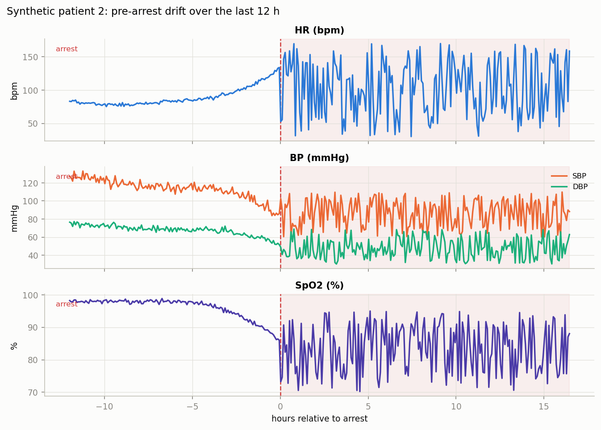
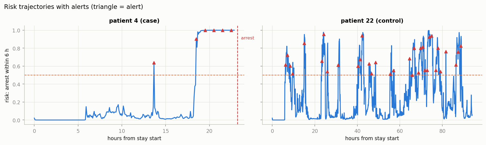
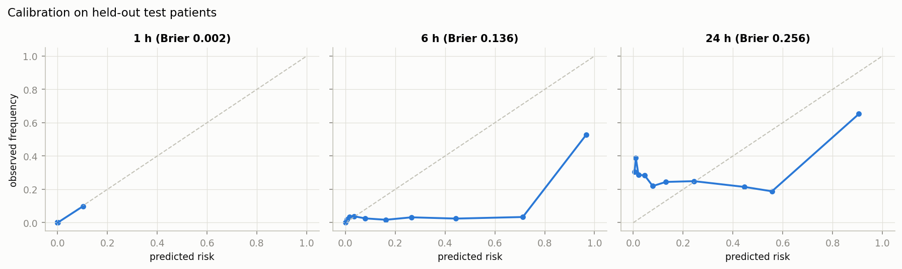
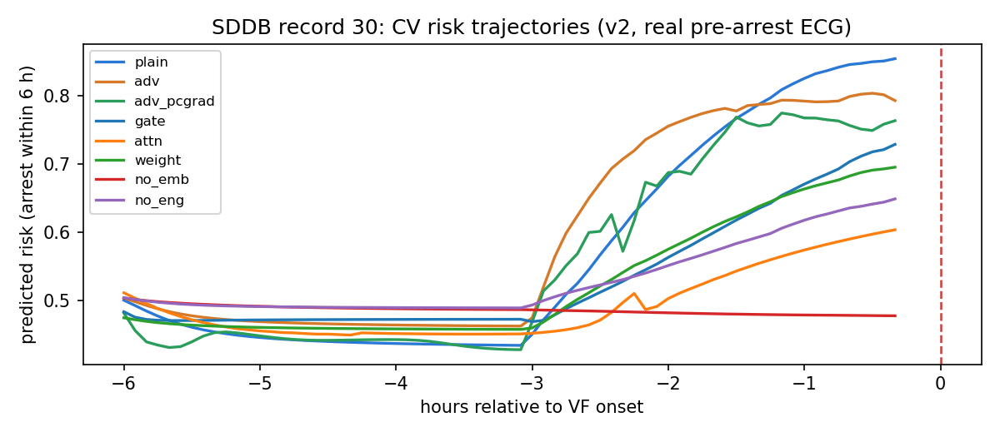
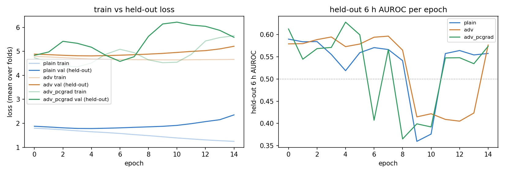
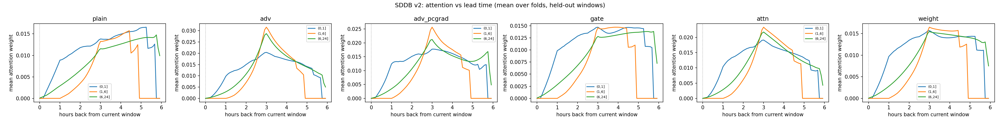

# A Multimodal Early Warning Pipeline for Cardiac Arrest Using Foundation Model Embeddings

Author(s): [to be added]
Date: 22 September 2026
Status: research prototype report

## Summary

We built and evaluated an end to end pipeline that scores a patient's risk of cardiac arrest in the next 1, 6 or 24 hours from bedside monitor signals (electrocardiogram, photoplethysmogram, arterial blood pressure and heart rate). The design follows the Wav2Arrest 2.0 framework: raw signals are summarized by two open foundation models (ECG FM and PaPaGei S), and a temporal network (bidirectional LSTM with attention, the FEAN design) consumes a 6 hour history of those summaries plus vitals and engineered features to produce per horizon risk estimates and a time to event estimate.

Two data regimes were used. First, a synthetic cohort of 60 patients with 28 injected arrest events validated every stage of the pipeline. Second, an open access real data stress test used the Sudden Cardiac Death Holter Database (23 patients, 20 with documented ventricular fibrillation onset) to measure how the model behaves on genuine pre arrest electrocardiograms.

Key findings: the pipeline runs end to end and achieves strong discrimination on synthetic data (6 hour AUROC 0.89 on held out patients), the synthetic trained model does not transfer to real data (zero shot AUROC 0.34 to 0.45), and models trained on the real database stay at or below chance at 6 hours across every architectural variant we tried (baseline, identity adversarial, gated or attention fusion, and a slow marker logistic regression). At 1 hour a weak but real signal exists, and it comes from engineered heart rate variability features, not from the foundation model embeddings. We interpret this as an honest negative result that bounds what Holter electrocardiograms alone can offer, and as motivation for the credentialed ICU data evaluation that remains the definitive test. Nothing in this report is clinical evidence.

## Methods

### Data

The synthetic cohort (60 patients, 28 arrest events, 42,261 five minute windows) generates monitor style signals at 125 Hz: a single lead electrocardiogram, a photoplethysmogram, an arterial pressure waveform and vitals, all coupled beat by beat through a pulse transit time. Arrest patients receive a 6 hour pre arrest drift (rising heart rate, falling blood pressure and oxygen saturation, falling heart rate variability, rising pulse transit time) so that downstream stages have a learnable signal. Ten percent of patients lack the photoplethysmogram stream to exercise missing modality handling. Quality defects (flatline, saturation, noise bursts) are injected in five percent of stream windows.

The real data stress test used the open access Sudden Cardiac Death Holter Database: 23 two lead 250 Hz Holter recordings of 4 to 25 hours, 20 of which have a documented ventricular fibrillation onset time used as the arrest timestamp. Photoplethysmogram, blood pressure and vitals are absent, so those feature blocks were zero filled. Five windows containing digitized tape gaps were excluded.

### Pipeline stages

1. Config and environment checks, with all third party assets printed and seeded.
2. Cohort and labels: per horizon binary labels ("arrest within H hours") plus a time to event target; windows during or after resuscitation are excluded and asserted in code.
3. Preprocessing: resampling to encoder targets (electrocardiogram 125 to 500 Hz by linear interpolation), rule based quality gates (flatline, saturation, signal to noise), 30 second segments, patient level splits only.
4. Engineered features from the waveforms: heart rate variability (mean RR, SDNN, RMSSD), ectopy burden, arterial pressure mean and variability, pulse transit time estimated per beat from the photoplethysmogram foot (correlation with ground truth 0.979 on synthetic data), and 30 minute vitals trends.
5. Baselines: logistic regression, gradient boosting and a MEWS style score (heart rate, systolic pressure, oxygen saturation only; respiratory rate, temperature and consciousness are missing components, stated explicitly).
6. Embeddings: ECG FM (wav2vec 2.0 style, 90.9 million parameters, pretrained on MIMIC IV ECG and PhysioNet 2021) maps 5 second 12 lead segments to 768 dimensions; PaPaGei S maps 10 second photoplethysmogram segments to 512 dimensions. Each encoder runs in its own conda environment via subprocess, and all embeddings are cached.
7. Temporal model (FEAN): per window features (7 vitals, 10 engineered, 768 electrocardiogram, 512 photoplethysmogram) are projected, processed by a two layer bidirectional LSTM, pooled by learned attention, then mapped to three sigmoid heads and a normalized time to event head. Loss: weighted binary cross entropy per horizon plus mean squared error on the time to event head for positive windows. Training is patient level: train, validation and test patients never overlap. Section 7 v2 adds an identity adversarial head (gradient reversal against a patient ID classifier) with PCGrad across task gradients, and a multimodal fusion comparison: concatenation versus gated fusion, modality attention and static per modality weights, with explicit presence masks per modality that route missing blocks to learned missing embeddings instead of zero filling.
8. Evaluation: AUROC, AUPRC and Brier with patient level bootstrap confidence intervals, calibration, alert replay simulation with a 60 minute refractory period, lead time statistics, time averaged AUC across lead time bins, failure review tables and feature block ablations.
9. Export of metrics, figures, configuration and third party commit hashes.

## Results

### Synthetic validation

The pipeline ran end to end on the synthetic cohort. Baselines and the temporal model on the patient level validation split:

<table>
<tr><th>Model</th><th>1 h AUROC</th><th>6 h AUROC</th><th>24 h AUROC</th></tr>
<tr><td>Logistic regression</td><td>1.000</td><td>0.954</td><td>0.689</td></tr>
<tr><td>Gradient boosting</td><td>0.998</td><td>0.993</td><td>0.911</td></tr>
<tr><td>FEAN temporal model</td><td>1.000</td><td>0.844</td><td>0.667</td></tr>
</table>
On the two held out replay patients (one case, one control), the trained pipeline produced:

<table>
<tr><th>Horizon</th><th>AUROC [95% CI]</th><th>AUPRC</th><th>Brier</th></tr>
<tr><td>1 h</td><td>1.000 [1.000, 1.000]</td><td>1.000</td><td>0.025</td></tr>
<tr><td>6 h</td><td>0.891 [0.825, 0.922]</td><td>0.785</td><td>0.315</td></tr>
<tr><td>24 h</td><td>0.946 [0.944, 0.948]</td><td>0.976</td><td>0.137</td></tr>
</table>

The time averaged AUC across lead time bins (0 to 1, 1 to 6, 6 to 24 hours) was 0.890. The alert simulation raised its first true alert 21.7 hours before the synthetic arrest, missed no window in the last 3 hours, and produced 5 false alarms in 24 hours on the control patient (4.9 per patient day). Feature block ablations on the 6 hour horizon gave: vitals only 0.755, vitals plus engineered 0.845, vitals plus embeddings 0.816, full model 0.859.

These numbers are inflated by design: the synthetic drift is deterministic. They validate the machinery, not the clinical value.

### Real data stress test (Sudden Cardiac Death Holter Database)

1829 real windows were embedded and evaluated. The 24 hour horizon is not evaluable on this database because no recording extends far enough before onset to supply 24 hour negatives, so it is omitted. A protocol fix over the first run matters: earlier numbers let sequence histories cross record and span boundaries, and were confounded by it. All numbers below use the corrected protocol (histories stay inside one record and one span, fixed seeds) with patient level bootstrap confidence intervals.

<table>
<tr><th>Model</th><th>1 h AUROC [95% CI]</th><th>6 h AUROC [95% CI]</th></tr>
<tr><td>Zero shot (synthetic trained model)</td><td>0.338</td><td>0.447</td></tr>
<tr><td>FEAN, concatenation (baseline)</td><td>0.632 [0.516, 0.748]</td><td>0.402 [0.344, 0.456]</td></tr>
<tr><td>FEAN, identity adversarial (gradient reversal)</td><td>0.697 [0.599, 0.792]</td><td>0.436 [0.368, 0.501]</td></tr>
<tr><td>FEAN, identity adversarial + PCGrad</td><td>0.663 [0.557, 0.781]</td><td>0.459 [0.382, 0.537]</td></tr>
<tr><td>FEAN, gated fusion + missing masks</td><td>0.655 [0.546, 0.778]</td><td>0.386 [0.337, 0.435]</td></tr>
<tr><td>FEAN, modality attention + missing masks</td><td>0.638 [0.519, 0.754]</td><td>0.473 [0.402, 0.538]</td></tr>
<tr><td>FEAN, static modality weights + missing masks</td><td>0.660 [0.546, 0.776]</td><td>0.394 [0.347, 0.443]</td></tr>
<tr><td>Ablation: engineered features only (no embeddings)</td><td>0.767 [0.705, 0.837]</td><td>0.508 [0.461, 0.555]</td></tr>
<tr><td>Ablation: embeddings only (no engineered)</td><td>0.707 [0.602, 0.812]</td><td>0.422 [0.377, 0.462]</td></tr>
<tr><td>Slow risk layer (3 h blocks, QT/TWA/HRV markers, LR)</td><td>0.426 [0.193, 0.667]</td><td>0.313 [0.190, 0.400]</td></tr>
</table>

We verified this is a genuine negative result rather than a training failure: train loss decreases across epochs while held out loss stays flat, and predictions spread widely, yet held out records remain at or below chance at 6 hours for every variant. On one fold several variants become confidently inverted (AUROC near 0), learning record specific patterns that do not transfer across 16 training patients.

What the variants teach us. (1) The models do recognize patients: a linear identity probe on the context vector classifies held out train windows into patients at 0.13 to 0.47 accuracy across variants (chance 0.05). The identity signal is carried by the embedding block (probe 0.439 without engineered features versus 0.130 without embeddings). Identity adversarial training helps slightly at both horizons but does not reduce the probe (0.423 to 0.470), so gradient reversal does not remove the leakage; modality attention is the only architecture that substantially reduces it (probe 0.143), and it is also the best held out variant at 6 hours. (2) The fusion comparison shows concatenation, gating and static weights are statistically indistinguishable, and modality attention is the best deep variant at 6 hours but also the least stable (a fold with AUROC 0). Missing modality masks route absent blocks to learned embeddings and keep predictions finite when streams disappear; they do not change the ranking. (3) The 1 hour signal is carried by engineered heart rate variability and ectopy features (0.767 without embeddings), and the ECG FM embeddings dilute it (0.632 full model). Attention salience shows the model spreads its attention over history and puts near zero weight on the current window.

Interpretation. The synthetic to real gap is real: the synthetic trained model carries nothing to real electrocardiograms. Training on the real database does not recover a 6 hour signal, most likely because (a) only 16 training patients were available, (b) the strongest modalities (photoplethysmogram, blood pressure, vitals) were absent, (c) Holter recordings differ from ICU bedside monitors, and (d) ventricular fibrillation onset often has no gradual electrocardiographic prodrome hours ahead, which is consistent with the literature. The weak 1 hour result from engineered features suggests that what little premonitory signal exists at that horizon is hemodynamic or rate based, which a Holter electrocardiogram only partially captures. This dataset therefore cannot validate a hemodynamic early warning system; it can only bound the electrocardiogram only regime.

### Robustness evaluation (synthetic)

Five perturbation families were applied to the held out replay patients and scored with the trained models (concat versus mask aware gate and weight): waveform noise and artifacts re embedded through the real encoders (ECG noise at SNR 20, 10 and 5 dB, baseline wander, 50 Hz mains, flatline halves, saturation, PPG noise at 5 dB) and feature level stress (vitals noise at 0.5 to 2 times the per column standard deviation, missing PPG, delayed measurements shifting the whole vector by 5, 10 and 15 minutes, and a sensor failure where PPG dies mid stay).

Result (6 hour AUROC, clean baseline 0.929 to 0.945): every perturbation lands within 0.03 of clean. The only directional effect is the delay family, which degrades monotonically but mildly (concat 0.929 to 0.920 at 15 minutes). Missing PPG, sensor failure, vitals noise and all ECG artifacts leave the score unchanged, and the mask aware models behave like concat here because synthetic PPG carries little signal.

Honest caveats: this measures robustness on synthetic data, where the risk signal lives in the vitals and engineered blocks (the earlier ablation finding), so waveform robustness partly reflects the encoders and partly that the embeddings matter little there; the quality gates would reject flatline and saturation windows in the real pipeline, and these tests bypassed the gates and still held; and with 2 replay patients these are point estimates. Real data robustness of the embedding path is bounded by the SDDB result (PPG entirely absent there).

## Figures

Figure 1: synthetic pre arrest drift for one patient over the last 12 hours before arrest (heart rate, blood pressure, oxygen saturation). Post arrest region shaded.

Figure 2: risk trajectories of the trained pipeline on the two held out patients with alert markers (triangles) and the alert threshold (dashed). The case patient (left) crosses the threshold about 21 hours before arrest.

Figure 3: calibration curves per horizon on the held out patients (predicted risk versus observed frequency, diagonal is perfect calibration).

Figure 4: cross validated risk trajectories for one real patient from the Sudden Cardiac Death Holter Database, hours relative to ventricular fibrillation onset. The predicted risk does not rise before the real event in any variant.

Figure 5: learning curves (train versus held out loss per epoch, mean over folds) for the three identity adversarial variants, and attention salience by lead time bin. Attention is spread over history, with near zero weight on the current window.

## Limitations

Synthetic results are not clinical evidence. The real data test uses 1980s Holter recordings without photoplethysmogram, blood pressure or vitals, and only 20 patients. Confidence intervals are wide everywhere, and several fold level metrics swing between 0 and 1, so single fold numbers must not be quoted. The adversarial head did not reduce linear identity leakage, and no fusion mode rescued the 6 hour result. The definitive evaluation requires the credentialed MIMIC III datasets (MIMIC III Ext CA annotations plus the waveform matched subset), which provide ICU bedside signals in exactly our modality set; that evaluation is pending access approval, and the loader is written and selftested. All work is a research prototype and must not be presented as clinical validation.

## Conclusion

A complete multimodal early warning pipeline was built, debugged and validated end to end on synthetic data, then stressed against the only open access real pre arrest dataset available. The honest outcome: the machinery is sound and reproducible, the synthetic benchmark is passed, and the real data test fails at 6 hours for every model variant, which correctly scopes the problem. The electrocardiogram alone, in a Holter regime with 20 patients, does not carry the 6 hour signal this model needs; the one robust hint of signal, at 1 hour, comes from engineered rate features, not embeddings. The next step is the credentialed ICU evaluation with full modalities.

## Reproducibility

Code: single notebook `Pipeline.ipynb` plus supporting scripts in `scripts/`. Embedding models: ECG FM (repository commit 9f926f19, weights from the official Hugging Face release) and PaPaGei S (repository commit 0c537dad, weights from Zenodo record 13983110). Real data: Sudden Cardiac Death Holter Database version 1.0.0 on PhysioNet (open access). All metrics, figures and configuration are exported to `outputs/`. Seeds are fixed; every expensive step is cached; no patient appears in more than one split.